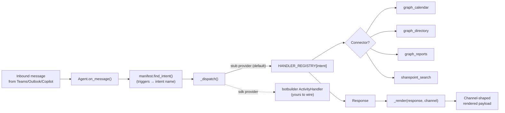

# M365 Agents SDK example

[](https://github.com/derekgallardo01/m365-agents-sdk-example/actions/workflows/ci.yml) [](LICENSE) [](#) [](https://codespaces.new/derekgallardo01/m365-agents-sdk-example)

**Docs:** [Getting started](docs/getting-started.md) · [Architecture](docs/architecture.md) · [Customization](docs/customization.md) · [Evaluation](docs/evaluation.md) · [Diagrams](docs/diagrams.md) · [FAQ](docs/faq.md)

**Live demo:** [derekgallardo01.github.io/m365-agents-sdk-example](https://derekgallardo01.github.io/m365-agents-sdk-example/) — six scripted turns across Teams, Outlook, and the Copilot canvas, regenerated on every push.

An agent shaped like a **Microsoft 365 Agents SDK** build:
declarative manifest + typed activity handlers + M365 connectors as
tools + channel-aware responses (Teams chat / Outlook email reply /
Copilot canvas adaptive card).

Default backend is an in-process stub — so the kit runs anywhere with
no Bot Framework registration, no Azure subscription, no Entra app.
The single seam (`Agent._dispatch`) swaps to the real SDK + Azure Bot
Service by setting `M365_AGENT_PROVIDER=sdk`.

```bash
pip install -e .
m365-agents-example                    # 6 scripted turns across 3 channels
m365-agents-example --validate-manifest  # static manifest check
```

```bash
python -m pytest -q     # 25 unit tests
python evals/run.py     # 6 golden eval cases
```

Stdlib-only Python in the default path. The real SDK
(`botbuilder-core`) is an optional extra installed via
`pip install -e ".[m365]"`.

## Run in Docker

```bash
docker build -t m365-agents-example .
docker run --rm m365-agents-example                       # runs the demo
docker run --rm m365-agents-example pytest -q             # runs the tests
docker run --rm -it m365-agents-example m365-agents-example --interactive
```

## What it's for

Microsoft's M365 Agents SDK is the framework for building agents that
live **inside** Microsoft 365 — Teams chat surfaces, Outlook reply
flows, Copilot canvas cards. Most "Copilot agent" tutorials show the
no-code Copilot Studio path; this kit shows the **SDK path** — what a
real Python-shaped agent looks like once you go past topic-builder
GUIs and need typed handlers, connectors, channel routing, and CI.

The kit gives you:

- **Declarative manifest** — channels, intents, connectors, in code
  that validates at boot (so you catch "intent X needs connector Y
  that doesn't exist" before deploy, not after)
- **Typed activity handlers** — one function per intent, easy to test
  in isolation
- **Mocked M365 connectors** — Graph calendar / directory / reports +
  SharePoint search, all returning realistic shapes so a swap to the
  live Graph is purely the body of each function
- **Channel-aware rendering** — same handler output rendered as Teams
  chat, Outlook HTML email, or Copilot canvas adaptive card
- **Conversation history** — per-user, per-channel, persisted within a
  session
- **Eval harness** — gates CI on intent matching + shape rendering +
  citation presence

## Intents

| Intent | When it fires | Connector(s) | Handler |
|---|---|---|---|
| `find_meeting` | "next meeting", "calendar", "schedule" | `graph_calendar` | `handle_find_meeting` |
| `lookup_person` | "who is", "find user", "email address for" | `graph_directory` | `handle_lookup_person` |
| `copilot_adoption` | "copilot adoption", "rollout status" | `graph_reports` | `handle_copilot_adoption` |
| `policy_question` | "what's our policy", "data residency", "compliance" | `sharepoint_search` | `handle_policy_question` |
| `escalate_to_human` | "escalate", "talk to a person" | (none) | `handle_escalate` |

Plus a fallback `unmatched` intent that lists the agent's
capabilities, so the user always gets a useful response.

## Channels

| Channel | `response_style` | Output shape |
|---|---|---|
| `teams` | chat | Plain text + citation footer |
| `outlook` | email | HTML body + Re: subject + structured signature |
| `copilot-canvas` | card | Adaptive Card JSON payload |

A new channel is one entry in the manifest + (if it needs a new shape)
one branch in `Agent._render`. Handlers and connectors don't change.

## Architecture



## The SDK swap point

The entire "stub vs real SDK" decision is one method:

```python
# src/m365_agents_example/agent.py
def _dispatch(self, handler_name, turn):
    if self.provider == "sdk":
        return self._dispatch_sdk(handler_name, turn)
    return self._dispatch_stub(handler_name, turn)
```

Everything else — manifest, intent matching, channel rendering,
conversation history — is shared. The SDK provider hooks the same
`HANDLER_REGISTRY` into the SDK's `ActivityHandler` pipeline; the
handlers themselves don't change.

`_dispatch_sdk` ships with a documented sketch. Wire it up when
you've provisioned the Bot Framework registration; the stub keeps
working in the meantime.

## What's inside

| Path | Purpose |
|---|---|
| `src/m365_agents_example/manifest.py` | Declarative manifest + intent matcher + validator |
| `src/m365_agents_example/handlers.py` | 5 typed intent handlers + registry |
| `src/m365_agents_example/connectors.py` | Mocked Graph + SharePoint connectors |
| `src/m365_agents_example/agent.py` | Agent loop + provider seam + channel renderer |
| `src/m365_agents_example/cli.py` | Scripted demo + REPL + manifest validator |
| `tests/test_manifest.py` | 8 manifest tests |
| `tests/test_handlers.py` | 9 handler tests |
| `tests/test_agent.py` | 8 agent loop + rendering tests |
| `evals/golden.json` | 6 eval cases |
| `evals/run.py` | Eval harness |
| `pyproject.toml` | Package + `m365-agents-example` script entry |

## Companion repos

- [claude-agent-sdk-example](https://github.com/derekgallardo01/claude-agent-sdk-example) — the same orchestration pattern using the **Claude Agent SDK** instead of M365's. Useful when the agent lives outside the M365 surface.
- [copilot-studio-support-agent](https://github.com/derekgallardo01/copilot-studio-support-agent) — the **no-code** path: same intent pattern but in Copilot Studio's hosted runtime. Compare the SDK build (this kit) vs the topic-builder GUI.
- [m365-audit-mcp](https://github.com/derekgallardo01/m365-audit-mcp) — MCP server exposing M365 audit data as tools. Pair: this kit's connectors are stand-ins for what an MCP-connected production agent would call.
