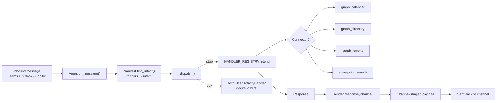
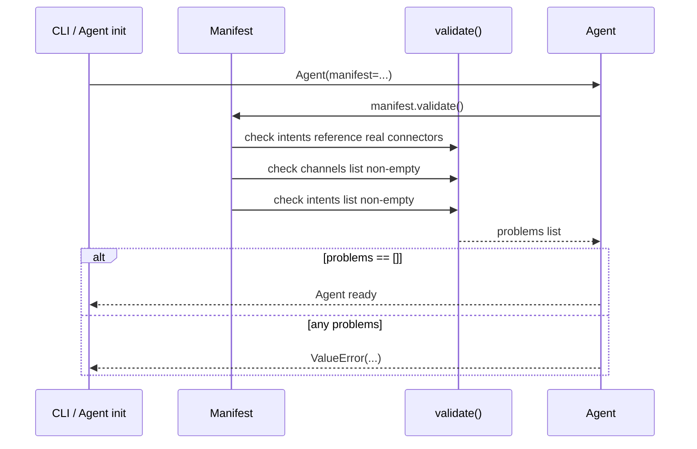
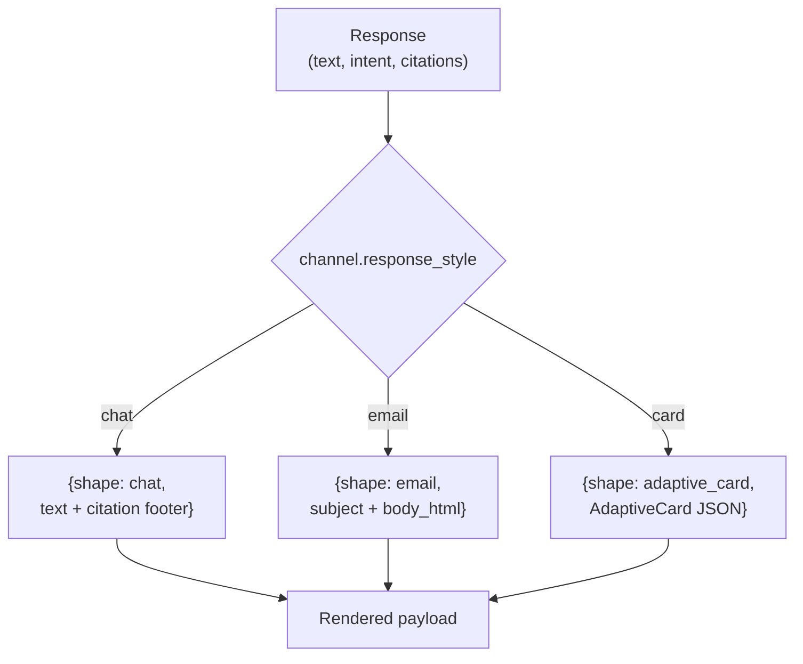
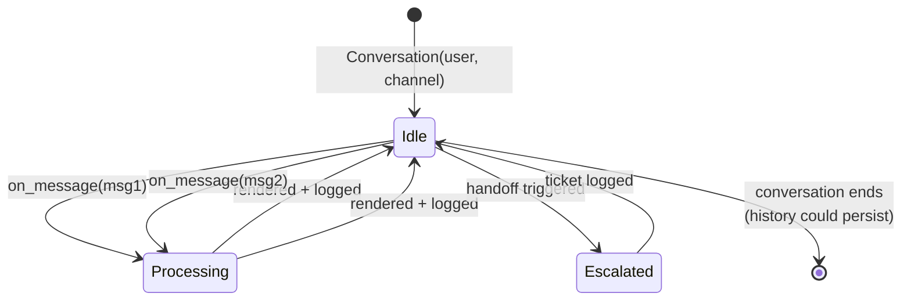
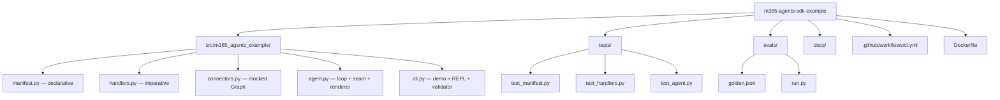

# Diagrams

GitHub renders Mermaid natively. These render on the README and in this file.

## End-to-end message flow



## Manifest validation lifecycle



## Channel rendering branches



## Stub vs SDK dispatch

```mermaid
flowchart TB
    subgraph Stub["stub provider (default)"]
        direction TB
        S1[Agent._dispatch_stub]
        S2[HANDLER_REGISTRY lookup]
        S3[handler(turn) → Response]
        S1 --> S2 --> S3
    end

    subgraph SDK["sdk provider"]
        direction TB
        C1[Agent._dispatch_sdk]
        C2["botbuilder ActivityHandler<br/>(on_message_activity)"]
        C3[TurnContext-aware dispatch]
        C4[Same HANDLER_REGISTRY entry runs]
        C5[handler(turn) → Response]
        C1 --> C2 --> C3 --> C4 --> C5
    end

    Stub -. "same Response shape" .- SDK
```

The handler is the same code on both paths. Only the message pump
that drove the call differs.

## Conversation state across turns



## Repo shape


